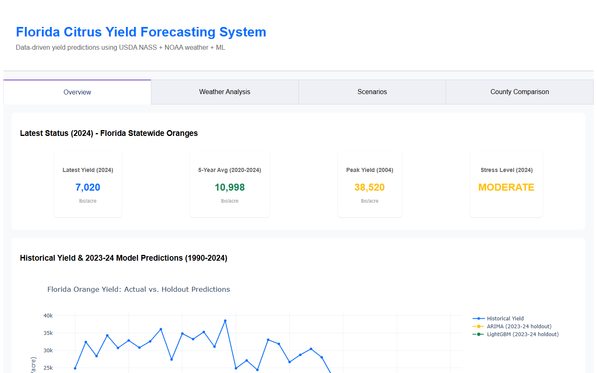

# Florida Citrus Yield Forecasting



An end-to-end pipeline and interactive dashboard that pulls real USDA NASS yield data and NOAA weather observations, engineers agronomic weather features, benchmarks an ARIMA baseline against LightGBM, and compares Florida's top four citrus counties.

**Live dashboard:** <https://florida-citrus-yield-forecast.onrender.com/> (free tier - the first load after idle can take about 40 seconds)

> **Scope note.** USDA NASS does not publish county-level citrus *yield* or *production* (checked for oranges and citrus totals, in both the survey and Census of Agriculture programs; production is published at state level only). The forecasting models therefore target **Florida statewide orange yield**. County-level analysis (Polk, Hendry, DeSoto, Highlands - the top four by 2022 bearing acreage) is limited to what is actually published or measurable: Census bearing acreage and local weather. **No county yield is estimated or fabricated anywhere in this project.**

## Headline findings

- **Florida orange yield fell 87% from its 2004 peak (38,520 lb/acre) to its 2023 low (5,130 lb/acre).** 2024 recovered slightly to 7,020.
- **Bearing orange acreage in the top four counties fell 41% between the 2002 and 2022 Censuses** (301,305 to 176,489 acres). Highlands lost 64%, Polk 46%, DeSoto 37%; Hendry rose to 94,267 acres in 2012 before falling back.
- **Both models failed to anticipate the 2023-24 collapse.** On a two-year holdout, ARIMA scored RMSE 5,860 and LightGBM 10,457 lb/acre - both over-predicted heavily (see [Model results](#model-results)). The collapse sits below anything in the 1990-2022 training window (minimum 11,250 in 2018), which tree models cannot extrapolate to.
- **Frost days were not a leading predictor** in the fitted model (7th of 12 by split count); lagged yield, temperature, GDD, and the trend term all ranked above it.
- **Frost exposure differs sharply by county.** Highlands averages 2.4 bloom-season frost days per year (max 14), versus 0.8 for Polk. 2010 is the worst frost year in all four counties (tied with 1996 and 2001 in DeSoto), consistent with the January 2010 Florida freeze.

## Data

| Dataset | Source | Details |
|---|---|---|
| Statewide orange yield | USDA NASS QuickStats (`api_GET`) | `ORANGES`, `YIELD`, `BOXES / ACRE`, all classes, state level, 1990-2024 (35 rows). Converted to lb/acre at 90 lb/box, the standard Florida orange box weight. |
| Daily weather (central Florida) | NOAA CDO v2 `/data`, GHCND | TMAX, TMIN, PRCP from Lakeland Linder, Tampa International, Orlando Executive, and Sebring (Sebring only from Dec 2007). 106,289 daily records. |
| County bearing acreage | USDA Census of Agriculture | Oranges, 2002/2007/2012/2017/2022, four counties (20 rows). Published every five years; never interpolated. |
| County daily weather | NOAA CDO v2 `/data`, GHCND | Two or more verified stations per county, 1990-2024. 281,383 daily records. |

Notes on data handling:

- NOAA station IDs were verified by querying actual observations across decades, not by trusting the station catalog (for example, Bartow Municipal is registered but returns no records).
- A physically-motivated outlier filter rejects sensor errors (TMAX outside 20-110 F, TMIN outside -5-85 F, PRCP outside 0-20 in). It removed 12 of 281,395 county records (e.g. a 115 F daily high, 101 F daily lows) and none of the state-level records.
- Weather features for the statewide model come from the four central-Florida stations above, averaged per day. This is a proxy for statewide conditions, not a statewide measurement.

## Pipeline

```bash
git clone https://github.com/brianravelo28/florida-citrus-yield-forecast.git
cd florida-citrus-yield-forecast
pip install -r requirements.txt
```

The cleaned datasets and model outputs are committed, so you can launch the dashboard immediately:

```bash
python run_dashboard.py          # http://127.0.0.1:8050  (run from the repo root)
```

To rebuild everything from the source APIs, get free keys from [USDA NASS QuickStats](https://quickstats.nass.usda.gov/api) and [NOAA CDO](https://www.ncei.noaa.gov/cdo-web/token), set `NASS_KEY` and `NOAA_TOKEN` at the top of `src/fetch_data.py` and `src/fetch_county_data.py`, then run:

```bash
# Statewide yield model (a failed API call stops the run and writes nothing)
python src/fetch_data.py                 # NASS yield + NOAA weather (a few minutes)
python src/feature_engineering.py        # merge + 13 feature columns -> data/df_model.csv
python src/train_models.py               # ARIMA + LightGBM -> results/model_results.json
python src/stress_indicator.py           # -> results/stress_indicator.csv

# County comparison panel
python src/fetch_county_data.py          # acreage + county weather (roughly 10-15 minutes)
python src/county_feature_engineering.py # -> data/county_features.csv
```

## Features

`df_model.csv` has 35 rows (one per year) and 16 columns: `county_name`, `year`, `yield_lbs_acre`, and the 13 feature columns below (12 model inputs plus the `log_yield` target). Temperatures are in degrees F and precipitation in mm. Daily values are averaged across stations before aggregation.

| Feature | Definition |
|---|---|
| `frost_days_bloom` | Days with TMIN <= 32 F, Jan-Mar |
| `tmax_mean_grow`, `tmin_mean_grow` | Mean daily max / min temperature, May-Aug |
| `temp_variance_grow` | Standard deviation of daily max temperature, May-Aug |
| `gdd_total_grow` | Growing degree days, base 50 F, May-Aug |
| `precip_total_grow` | Total precipitation, May-Aug |
| `precip_rolling_30/60/90` | Largest 30/60/90-day rolling precipitation sum within May-Aug |
| `precip_deviation` | `precip_total_grow` minus its 1990-2024 mean |
| `yield_lag1` | Previous year's yield |
| `year_numeric` | Calendar year (trend) |
| `log_yield` | `log(1 + yield_lbs_acre)`, the LightGBM target |

## Model results

Both models are trained on 1990-2022 and evaluated on 2023-2024 (a single two-year temporal holdout). LightGBM uses 12 standardized inputs and a `log_yield` target (1991-2022 after dropping the first lag row), with `learning_rate=0.05`, `num_leaves=31`, `max_depth=5`, `min_data_in_leaf=10`, 200 rounds.

| Model | RMSE (lb/acre) | MAE (lb/acre) | 2023 pred. | 2024 pred. |
|---|---|---|---|---|
| Actual | - | - | 5,130 | 7,020 |
| ARIMA(1,1,1), yield only | 5,860 | 5,775 | 11,902 | 11,798 |
| LightGBM, weather + lag + trend | 10,457 | 10,419 | 16,439 | 16,548 |

LightGBM is *worse* than the univariate baseline here. Its predictions are nearly flat because tree leaves cannot output values below the range seen in training, while ARIMA's differenced trend extrapolates part of the way down. With only two test points and 32 training rows, this comparison has very high variance and should be read as a diagnosis of the 2023-24 break, not as a ranking of the methods.

Feature importance (LightGBM split counts - not SHAP):

| Rank | Feature | Splits |
|---|---|---|
| 1 | `yield_lag1` | 57 |
| 2 | `tmax_mean_grow` | 44 |
| 3 | `tmin_mean_grow` | 42 |
| 3 | `year_numeric` | 42 |
| 5 | `gdd_total_grow` | 36 |
| 6 | `precip_total_grow` | 21 |
| 7 | `frost_days_bloom` | 19 |

No forecast beyond 2024 is produced.

## Climate stress indicator

A weather-based score per year, with thresholds computed from 1990-2020:

```
stress = 0.4 * min(frost_days / p75_frost_days, 2)
       + 0.3 * min(|precip_deviation| / std_precip_deviation, 2)
       + 0.2 * clip(mean_gdd / gdd, 0.5, 2)
       + 0.1 * 1[yield < 25th percentile of yield]
```

`HIGH` > 1.0, `MODERATE` > 0.5, otherwise `LOW`. Result across 35 years: 8 HIGH (1996, 1997, 1999, 2001, 2009, 2010, 2015, 2018), 14 MODERATE, 13 LOW.

The indicator is built from weather inputs (plus a low-yield flag), so it does not register disease or hurricane damage: it scores 2023 - the record-low yield year - as LOW (0.36). Treat it as a frost/precipitation/heat risk gauge, not a yield-loss predictor.

## Dashboard

Four-tab Plotly Dash app (`src/app.py`), with zoom/legend interaction hints under every chart.

1. **Overview** - KPI cards computed from the data (latest yield, 5-year average, peak yield, latest stress level), historical yield with the ARIMA and LightGBM holdout predictions for 2023-24, and the stress-score timeline.
2. **Weather Analysis** - temperature, precipitation, and bloom-season frost-day time series; top-10 LightGBM feature importance.
3. **Scenarios** - slider for a 0-50% increase in frost days relative to the 1990-2024 average (0.77 days/year). Illustrative only: it assumes 2,000 lb/acre lost per additional frost day (an assumption, not a fitted coefficient), $0.45/lb, and 50,000 acres. At +50%, yield goes from 7,020 to 6,249 lb/acre, about $17.4M in lost revenue.
4. **County Comparison** - county checklist; bloom-season frost days by county; Census bearing-acreage trends; and a **Yearly Outlook** panel (year dropdown) comparing frost days, mean max temperature, and GDD across the selected counties.

## Known limitations

- **Yield is statewide; weather is central Florida.** The statewide yield model uses four central-Florida stations as a proxy.
- **Two-year holdout.** Reported errors rest on two test points. There is no rolling-origin cross-validation (`fit_lightgbm_wfcv` is named for it but fits a single split).
- **The 2023-24 collapse is unexplained by the features.** Citrus greening (HLB) and hurricane damage are not modelled.
- **Scenario tab mixes scopes.** It applies the statewide per-acre yield to a 50,000-acre figure, so the dollar impact is illustrative.
- **County precipitation has gaps.** Missing precipitation days are counted as zero rain. The statewide series is fully covered, but 19 of 140 county-years have incomplete May-Aug precipitation and three (Highlands 2022, DeSoto 1990 and 1993) have under 40 observed days, so their precipitation features are unreliable.
- **Station coverage varies.** Sebring covers only Dec 2007 onward, and county stations have different start and end dates (see `docs/API_SOURCES.md`).

## Project structure

```
src/
  fetch_data.py                  # NASS yield + NOAA weather (statewide model)
  feature_engineering.py         # weather aggregation, 13 feature columns
  train_models.py                # ARIMA + LightGBM
  stress_indicator.py            # climate stress score
  fetch_county_data.py           # county acreage + county weather
  county_feature_engineering.py  # per-county features
  app.py                         # Dash dashboard (4 tabs)
data/                            # nass_yield, noaa_weather, df_model, county_acreage, county_weather, county_features (CSV)
results/                         # model_results.json, stress_indicator.csv
docs/                            # schema, methodology, API notes, citations
run_dashboard.py                 # local entry point
render.yaml                      # Render settings (reference)
RENDER_DEPLOYMENT.md             # deployment notes
```

## Deployment

Deployed on [Render](https://render.com) (build: `pip install -r requirements.txt`; start: `gunicorn src.app:server --bind 0.0.0.0:$PORT`). The data and results files are committed because the app loads them at startup, and no API keys are needed at runtime. See [RENDER_DEPLOYMENT.md](RENDER_DEPLOYMENT.md).

## License

MIT - see [LICENSE](LICENSE).

Data: USDA NASS QuickStats, USDA Census of Agriculture, NOAA NCEI Global Historical Climatology Network (daily).
